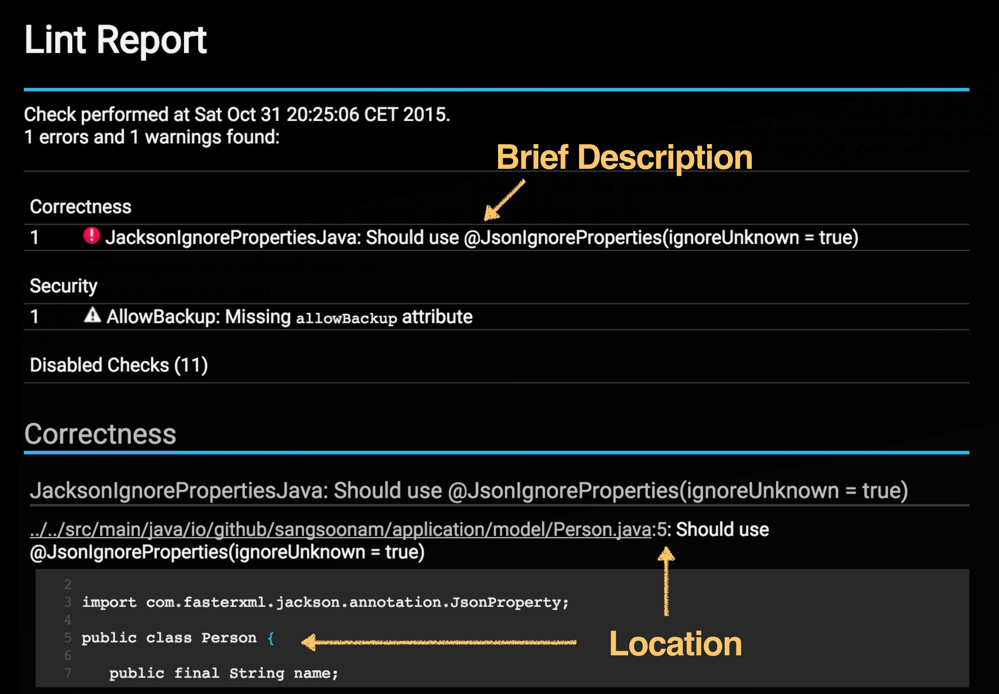
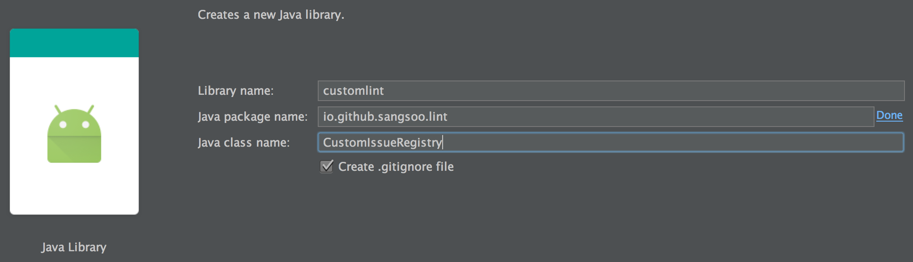

Lint is a static code analysis tool. Based on rules, it analyzes code and shows warnings or errors. In addition to existing rules, you can write additional rules. Those rules could be about library usage requirements or company rules, including code styles. I believe that this tool is really useful for collaboration. You can write a custom rule, and it will prevent from other developers's same mistake. See this report. It contains a nice explanation and even a problem location.   
 



This repository contains examples of custom rules and unit tests. If you would make and apply custom rules, checking this code would be helpful.

## How to Run
Running custom rules is easy. After cloning this repository, run this commend. Since this repository code has static errors, you can see a error message after executing. There is a nice html result. If you open it, you can see a similar screen which is shown above.


```bash
❯ ./gradlew lint

...
:app:lint
> Custom Lint is working with (JacksonIgnorePropertiesJava, JacksonConstructorWithNonNullOrNullable, RegisterUnregister, StringsSortedByName)
Ran lint on variant release: 7 issues found
Ran lint on variant debug: 7 issues found
Wrote HTML report to file:/Users/sangsoonam/git/CustomAndroidLint/app/build/outputs/lint-results.html
Wrote XML report to /Users/sangsoonam/git/CustomAndroidLint/app/build/outputs/lint-results.xml
:app:lint FAILED

FAILURE: Build failed with an exception.

* What went wrong:
Execution failed for task ':app:lint'.
> Lint found errors in the project; aborting build.
  
  Fix the issues identified by lint, or add the following to your build script to proceed with errors:
  ...
  android {
      lintOptions {
          abortOnError false
      }
  }
  ...

* Try:
Run with --stacktrace option to get the stack trace. Run with --info or --debug option to get more log output.

BUILD FAILED
```

## How to Create
First, you'll need to create a seperate java module. In Android Studio, select 'File > New > New Module' and 'Java Library'. Type `customlint` for a library name, `CustomIssueRegistry` for a java class name and proper your package name.



### Set Lint Dependency and Manifest Entry
Once you finish it, you need to specify a lint-api dependency and a right manifest entry. Change `customlint/build.gradle` like below:

```
apply plugin: 'java'

dependencies {
    compile 'com.android.tools.lint:lint-api:24.3.1'
}

jar {
    archiveName 'lint.jar'
    manifest {
        attributes("Lint-Registry": "io.github.sangsoonam.lint.CustomIssueRegistry")
    }
}
```

### Extend IssueRegistry
There are three main concepts: Issue, Detector and IssueRegistry. Issue is a definition of problem you want to show. Detector identifies one or more types of issues. IssueRegistry is a list of issues. You just specified a class, `CustomIssueRegistry`,  as a manifest entry. To provide custom rules properly, `CustomIssueRegistry` should extend `IssueRegistry`. `IssueRegistry` has only one method, `getIssues`. `CustomIssueRegistry` will be:

```java
public class CustomIssueRegistry extends IssueRegistry {

	@Override
	public List<Issue> getIssues() {
		return Arrays.asList(
			JacksonIgnorePropertiesJavaDetector.ISSUE // See a next section
		);
	}	
}
```

### Create Issue
You can create an issue using a `Issue.create`. It requires many parameters like below:
```java
public static Issue ISSUE = Issue.create(
  "JacksonIgnorePropertiesJava",                                  // ID
  "Should use @JsonIgnoreProperties(ignoreUnknown = true)",       // Brief Description
  "By default, @JsonIgnoreProperties(ignoreUnknown = false)..." + // Explanation
  Category.CORRECTNESS,                                           // Category
  6,                                                              // Priority
  Severity.ERROR,                                                 // Severity
  new Implementation(
     JacksonIgnorePropertiesJavaDetector.class,                   // Detector
     Scope.Java_FILE_SCOPE                                        // Scope
  )
);
```

Other parameters are quite obvious, but there are two interesting parameters: `Detector` and `Scope`. `Scope` states a checking range. There are four popular scopes:

* `Scope.JAVA_FILE_SCOPE`: For checking java files. `Detector` should implement `JavaScanner` interface.
* `Scope.CLASS_FILE_SCOPE`: For checking class files. `Detector` should implement `ClassScanner` interface.
* `Scope.RESOURCE_FILE`: For checking resource files. `Detector` should implement `XmlScanner` interface.
* `Scope.MANIFEST_FILE`: For checking manifist files. `Detector` should implement `XmlScanner` interface.

### Create Detector
`Detector` is responsible to find issues and report. See an example [JacksonIgnorePropertiesJavaDetector.java](/customlint/src/main/java/io/github/sangsoonam/lint/detector/jackson/ignoreunknown/JacksonIgnorePropertiesJavaDetector.java). In the detector, you can mention about the problem location when calling `report`.
```java
mContext.report(ISSUE, mContext.getLocation(node.getParent()), "Should use @JsonIgnoreProperties(ignoreUnknown = true)");
```

> You can see more details on http://tools.android.com/tips/lint/writing-a-lint-check.


### Copy Custom Rules
Until now, there is no relationship between your `app` module and `customlint` module. It means that your custom rules will not be executed when you run `./gradlew lint`. When lint runes, it will look for custom rule jar files in:

* ANDROID_SDK_HOME
* user.home
* HOME

Once you copy your `lint.jar` file into one of those directories, it will work. As you see, it needs an access outside of code repository. Thus, it doesn't fit well for collaboration or continuous intergration. Instead of that, I recommend to copy it into build directory. Change your `app/build.gradle` like this:

```
configurations {
    customLint
}

task copyLintJar(type: Copy) {
    from (configurations.customLint)
    into "$buildDir/lint"
}

project.afterEvaluate {
    it.tasks.compileLint.dependsOn copyLintJar
}

dependencies {
    customLint project(path:':customlint', configuration: 'archives')
}
```


## How to Do Unit Test

First of all, you need to add a dependency in `customlint/build.gradle`
```
dependencies {
    testCompile 'com.android.tools.lint:lint-tests:24.3.1'
}
```

Testing custom rules is a bit different from regular java unit tests. For example, every Android application has only one Android manifest file. How do you test variant versions of Android manifest files? For that, there are two methods: `lineFiles` and `lintProject` in `LintDetectorTest`. Basically, it makes an temporary Android project by copying parameter files for testing. While copying, you can rename a file. For instance, `AndroidManifest_missing_label.xml` file will renamed as a name `AndroidManifest.xml`.

```java
lintFiles("AndroidManifest_missing_label.xml=>AndroidManifest.xml")
```

One way to store testing files is put those into a `test/java/res` directory. However, I prefer to create a sample module for testing since it will generate class files for class scope testing.  The minimum dependency between `sample` module and `customlint` is set like this in `customlint/build.gradle`:

```
project.afterEvaluate {
    tasks.compileTestJava.dependsOn ':customlint:sample:assemble'
}
```

To make unit testing simplify, I made a helper class [AbstractDetectorTest.java](/customlint/src/test/java/io/github/sangsoonam/lint/AbstractDetectorTest.java) which finds testing files from a `sample` module and rename properly. You can see how it is simplifed in here, [JacksonIgnorePropertiesJavaDetectorTest.java](/customlint/src/test/java/io/github/sangsoonam/lint/detector/jackson/ignoreunknown/JacksonIgnorePropertiesJavaDetectorTest.java)

## License
Licensed under the MIT License.
